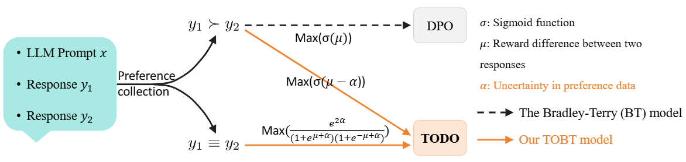

# TODO: Enhancing LLM Alignment with Ternary Preferences
## 🎉 TODO has been accepted by ICLR 2025.
## Overview

Aligning large language models (LLMs) with human intent is critical for enhancing their performance across a variety of tasks. Standard alignment techniques, such as Direct Preference Optimization (DPO), often rely on the binary Bradley-Terry (BT) model, which can struggle to capture the complexities of human preferences—particularly in the presence of noisy or inconsistent labels and frequent ties. To address these limitations, we introduce the **T**ie-rank **O**riented **B**radley-**T**erry model (TOBT), an extension of the BT model that explicitly incorporates ties, enabling more nuanced preference representation. Building on this, we propose **T**ie-rank **O**riented **D**irect Preference **O**ptimization (TODO), a novel alignment algorithm that leverages TOBT's ternary ranking system to improve preference alignment. In evaluations on Mistral-7B and Llama 3-8B models, TODO consistently outperforms DPO in modeling preferences across both in-distribution and out-of-distribution datasets. Additional assessments using MT Bench and benchmarks such as Piqa, ARC-c, and MMLU further demonstrate TODO's superior alignment performance. Notably, TODO also shows strong results in binary preference alignment, highlighting its versatility and potential for broader integration into LLM alignment. The code for TODO is made publicly available.



## Set ups

```sh
conda create -n TODO python=3.9 -y && conda activate TODO
pip install -r requirements.txt
```

## Datasets

Please download the datasets from https://huggingface.co/datasets/irisxx/ultrafeedback_tied, the train directory contains four train sets with different ratios of tie data. And the test directory contains the in-distribution test set non_tie_data_test.jsonl.

| Train data | Path                             |
| ---------- | -------------------------------- |
| ratio 0    | train/mixed_data_ratio_0.jsonl   |
| ratio 0.1  | train/mixed_data_ratio_0.1.jsonl |
| ratio 0.2  | train/mixed_data_ratio_0.2.jsonl |
| ratio 0.3  | train/mixed_data_ratio_0.3.jsonl |

| Test data | Path                         |
| --------- | ---------------------------- |
| test set  | test/non_tie_data_test.jsonl |

## Usage and Examples

#### Training

First, set up training config in a yaml. You can select any dataset used to conduct DPO or TODO training.

##### DPO training

```shell
accelerate launch --config_file deep_zero3_config_process.yaml dpo_tie_train.py --train_args_file ./train_args/mistral-7b-dpo.yaml

accelerate launch --config_file deep_zero3_config_process.yaml dpo_tie_train.py --train_args_file ./train_args/llama3-8b-dpo.yaml
```

##### TODO training

```shell
accelerate launch --config_file deep_zero3_config_process.yaml dpo_tie_train.py --train_args_file ./train_args/mistral-7b-TODO.yaml

accelerate launch --config_file deep_zero3_config_process.yaml dpo_tie_train.py --train_args_file ./train_args/llama3-8b-TODO.yaml
```

#### TODO evalutation

##### Evaluation on test test

For DPO evaluation 

```shell
CUDA_VISIBLE_DEVICES=0,1 python3 dpo_tie_eval.py \
        --model ${policy_model_name_or_path} \ #policy model
        --ref_model ${reference_model_name_or_path}  \ #ref model
        --dataset_path ${test_set_path} \ #path of test set
        --original_reward 0 \ #0 for DPO and 1 for TODO
        --dpo_beta 0.01 \ # beta value during alignment process
        --batch_size 8
```

For TODO evaluation

```shell
CUDA_VISIBLE_DEVICES=0,1 python3 dpo_tie_eval.py \
        --model ${policy_model_name_or_path} \ #policy model
        --ref_model ${reference_model_name_or_path}  \ #ref model
        --dataset_path ${test_set_path} \ #path of test set
        --original_reward 1 \ #0 for DPO and 1 for TODO
        --dpo_beta 0.01 \ # beta value during alignment process
        --dpo_theta -0.5 \ # default is -0.5, represents the -alpha value in TODO, the same as training process
        --batch_size 8
```

##### Evalutaion of Reward Bench

We directly modify the implementation of Reward Bench to evaluate the preference modeling ability of DPO and TODO, please refer to the implementation of **https://github.com/XXares/TODO_reward_bench**.

#### Evalution on MT bench

We evaluate the performance follows the instruction of https://github.com/lm-sys/FastChat/tree/main/fastchat/llm_judge

##### Noting that we  use gpt-4-turbo-2024-04-09 to score generated results.

#### Evaluation of series popular benchmarks

We evalutaion the other benchmarks using opencompass . Pleaso first set up the environment required by opencompass follows the instruction https://github.com/open-compass/OpenCompass/ and we use the following prompt templates.

| Task            | piqa            | arc-c            | arc-e            | mmlu            | hellaswag            | winogrande           |
| --------------- | --------------- | ---------------- | ---------------- | --------------- | -------------------- | -------------------- |
| Prompt template | piqa_ppl_1cf9f0 | ARC_c_ppl_d52a21 | ARC_e_ppl_d52a21 | mmlu_ppl_ac766d | hellaswag_ppl_9dbb12 | winogrande_ll_c5cf57 |

Then you can evaluate the performance of popular benchmakrs using following shell instruction.

```shell
python run.py --models ${model_name_or_path} --datasets piqa_ppl ARC_c_ppl ARC_e_ppl mmlu_ppl hellaswag_ppl winogrande_ll
```

## Citation
Please cite our paper if you find the repo helpful in your work:
```
@misc{guo2024todoenhancingllmalignment,
      title={TODO: Enhancing LLM Alignment with Ternary Preferences}, 
      author={Yuxiang Guo and Lu Yin and Bo Jiang and Jiaqi Zhang},
      year={2024},
      eprint={2411.02442},
      archivePrefix={arXiv},
      primaryClass={cs.CL},
      url={https://arxiv.org/abs/2411.02442}, 
}
```


